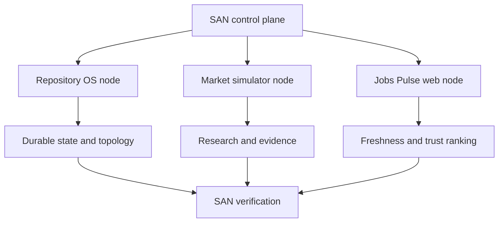

# C_fit_AI: Engineering Overview

C_fit_AI is a dual-node, stateless-agent-native workspace containing an evidence-grounded Colombo market simulator and a trusted jobs-intelligence product. A machine-readable repository operating system keeps both products discoverable, isolated, recoverable, and verifiable.

## At a glance

| Area | Implementation |
| --- | --- |
| Product nodes | AI market simulator and Colombo Jobs Pulse web application |
| Core stack | Python, React, TypeScript, Vite, Vitest, pytest |
| Repo OS | Canonical control plane, durable state, runtime manifest, topology graph, SANLOCK scorecard |
| Trust model | Explicit authority, deterministic scoring, evidence snapshots, no hidden weights or silent drift |
| Verification | SAN synchronization, topology/preflight refresh, 34 Python tests, 4 web tests, web typecheck |

## Why this project is technically interesting

- **The repository is machine-operable.** Agents can recover current authority, topology, state, and verification entry points from canonical manifests.
- **Two products share infrastructure without sharing authority.** Market simulation and jobs intelligence remain separate bounded nodes.
- **Scoring is inspectable.** Inputs, weights, evidence, trust signals, and ranking behavior are intended to be explainable and diffable.
- **State is designed for cold starts.** A new agent can reconstruct what exists and what remains without relying on chat history.

## System shape

## Guided code tour

1. **`san/`** — canonical manifests, topology, durable state, preflight, and SANLOCK.
2. **`simulation/`, `model/`, `scoring/`, and `research/`** — evidence-grounded market simulation.
3. **`apps/web/`** — Colombo Jobs Pulse React product and its tests.
4. **`data/snapshots/`** — retained public-source observations used by the model.
5. **`trust/`, `ranking/`, and `contracts/`** — transparent decision and confidence boundaries.
6. **`scripts/san_*.py`** — deterministic synchronization, topology, preflight, and verification entry points.

## Verification

`uv run python scripts/san_verify.py` currently passes and proves:

- canonical mirrors synchronize;
- topology and preflight generation complete;
- 34 Python tests pass;
- 4 web tests pass;
- the web TypeScript typecheck passes;
- both bounded product nodes remain discoverable.

The Git-history findings are two public Drupal page-state tokens inside retained Central Bank source snapshots, not private credentials.

## For coding agents

1. Read `AGENTS.md` and the canonical SAN manifests in their documented order.
2. Mutate canonical JSON authority first; regenerate human-readable mirrors through the provided scripts.
3. Preserve node boundaries and deterministic scoring behavior.
4. Keep public-source snapshots attributable and do not promote prompt-era artifacts into runtime truth.
5. Finish with `scripts/san_verify.py`.

## Current boundaries

- Some product surfaces remain research or staged product work rather than a deployed service.
- Public source snapshots prove what was observed at capture time, not current external-site state.
- The SAN layer improves recoverability and authority hygiene; it is not itself an external security certification.

## What this repository demonstrates

C_fit_AI demonstrates advanced AI repository architecture: bounded product nodes, machine-readable governance, evidence-backed simulation, explainable ranking, full-stack verification, and state designed for reliable agent handoffs.
